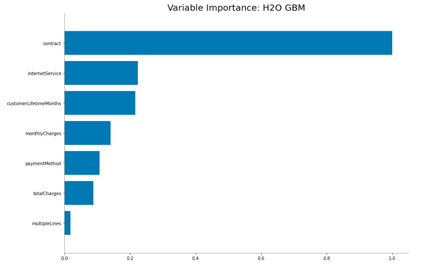

# Telco Customer Churn 

<br> 
[Image source](https://medium.com/@Experfy/building-predictive-models-for-customer-churn-in-telecom-4864d759ebf8)

Customer churn is critical for all kind of companies. 
My project's aim is to show a solution for a telco company's customer churn modelling with h2o. 
The result (the scores) of the developed model could be used for campaign activities. 

## Content of files in the project folder 

|file name| description|
|----|----|
| data | contains the dataset downloaded from Kaggle|
| img | contains images used in README.md |
| Grid_GBM_py_2_sid_9f00_model_python_1585656568205_1021_model_1 | final h2o model|
| README.md| README file |
| telco_customer_churn.ipynb | Jupyter notebook containing all the steps of the modelling process with small descriptions. |
| utils.py | A collection of functions used during the modelling process. |


## Dataset
The original dataset can be found on [Kaggle](https://www.kaggle.com/blastchar/telco-customer-churn).

### Column description 

| variable name  |  description |possible values (if categorical)
|---|---|---|
| customerId | customer identification  ||
| gender | Whether the customer is a male or a female.  |Male, Female|
| seniorCitizen | Whether the customer is a senior citizen or not. | Yes, No |
| partner |  Whether the customer has a partner or not. | Yes, No |
| dependents | Whether the customer has dependents or not.| Yes, No |
| customerLifetimeMonths | Number of months the customer has stayed with the company. ||
| phoneService  | Whether the customer has a phone service or not. | Yes, No |
| multipleLines | Whether the customer has multiple lines or not. | Yes, No, No phone service |
| internetService | Customer’s internet service provider. | DSL, Fiber optic,  |
| onlineSecurity | Whether the customer has online security or not. | Yes, No, No internet service |
| onlineBackup | Whether the customer has online backup or not. | Yes, No, No internet service |
| deviceProtection | Whether the customer has device protection or not.  | Yes, No, No internet service |
| techSupport |Whether the customer has tech support or not. | Yes, No, No internet service |
| streamingTV | Whether the customer has streaming TV or not. | Yes, No, No internet service |
| streamingMovies | Whether the customer has streaming movies or not.   |Yes, No, No internet service|
| contract | The contract term of the customer. |Month-to-month, One year, Two year|
| paperlessBilling | Whether the customer has paperless billing or not.| Yes, No |
| paymentMethod  |The customer’s payment method.  |Electronic check, Mailed check, Bank transfer (automatic), Credit card (automatic) |
|paymentIsElectronic| Whether the customer's payment is electronic or not. | Yes, No|
| monthlyCharges  | The amount charged to the customer monthly. ||
| totalCharges | The total amount charged to the customer. ||
| churn | Whether the customer churned or not | Yes, No |

# Results 

| AUC |	Customer Nbr | Target Nbr | Cum Capture Rate TOP 10% | Cum Response Rate TOP 10% | Target Found TOP 10%	| Cum Capture Rate TOP 20% | Cum Response Rate TOP 20% | Target Found TOP 20% |
|---|---|---|---|---|---|---|---|---|
| 0.84 | 2093 |	550 | 0.29 | 0.75 | 159 | 0.50 | 0.65 | 275| 


If we want to use the best model from the developed for CRM activity, we can catch
- the 29% of all churning customers with selecting only the TOP 10% and
- the 50% with selecting the TOP 20% <br>
of the customer base according to the model's scores (for example for campaigns).

## Variable importance

The most important variables based on the variable importance:



## Package versions

```
Package                Version
---------------------- -------------------
h2o                    3.28.1.2
matplotlib             3.2.1
numpy                  1.18.1
pandas                 1.0.3
seaborn                0.10.1
```
